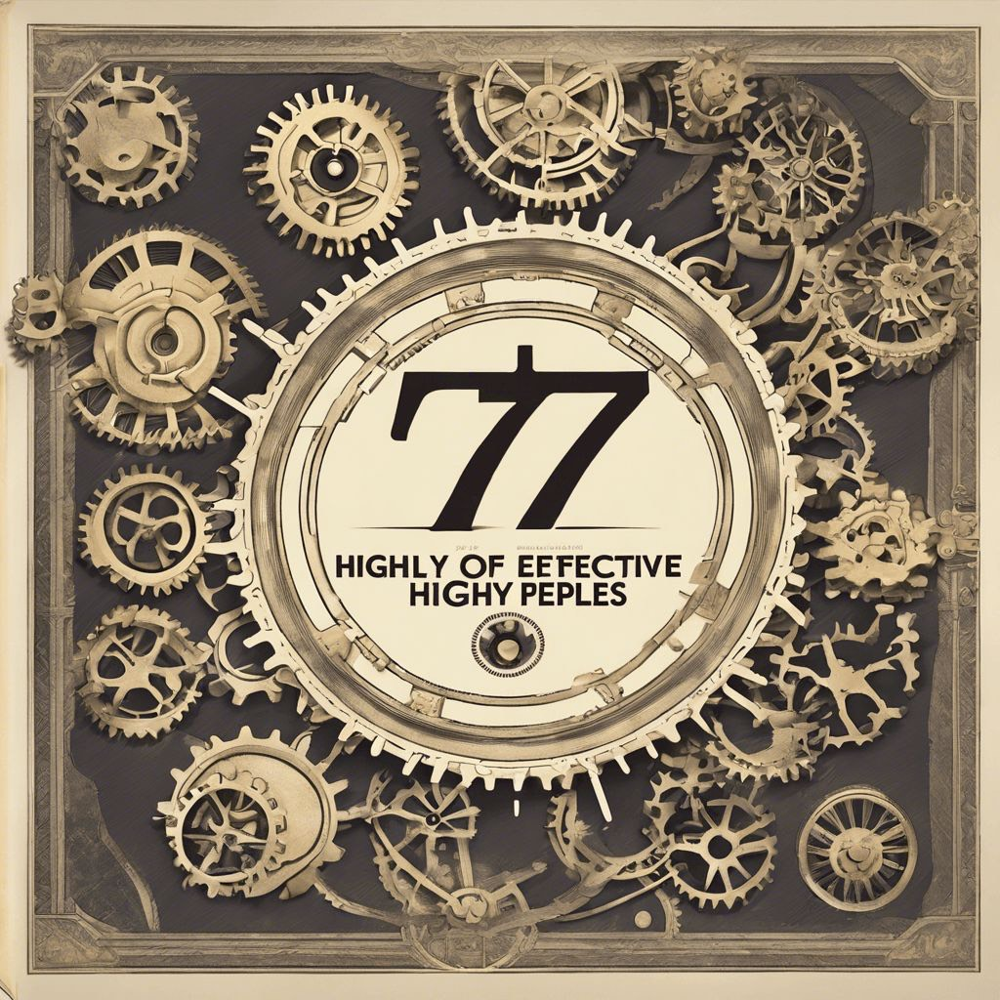

# Los 7 hábitos de la gente altamente efectiva de Stephen R. Covey

---

## 1. Los hábitos correctos son el secreto del éxito en la vida 🌟🔄 💪🎯

- Los hábitos 💫 son como los arquitectos invisibles 🏗️ que moldean nuestro carácter humano 🧠💪🌟

- La clave 🔑 está en hacer del esfuerzo un entrenamiento 🏋🏽 hacia la meta deseada. 💃✨🎯 #EntrenandoElÉxito
- ⚡Nadie mejora por accidente
- Iniciar es desafiante, avanzar es difícil, ¡pero el logro final es la dulce recompensa del buen hábito! 🚀💪😊 #PersistenciaFructífera
- ¡Aprender habilidades específicas es la llave maestra para transformar nuestro comportamiento! 🗝️💡🔄 #CambioConHabilidades
- ⚡El cambio de caracter es más duradero que el cambio de comportamiento.
- El trabajo en nuestro carácter es un viaje hacia una nueva identidad. ¡Aprender a desaprender es la clave! 🔄🚀🧠 #TransformaciónInterior
- Al ajustar nuestra perspectiva, creencias y hábitos, trazamos el camino hacia el éxito sostenible. 🌟🔄🚀 #EvoluciónHaciaElÉxito
- Al ajustar mis creencias y forjar hábitos, construyo la senda hacia la efectividad excepcional. 💡🌟💪 #CreenciasPotenciadoras
---

## 2. Centrate en áreas especificas de tu vida y modifica tus pradigmas para iniciar tu cambio duradero

### 7 áreas clave para ser altamente efectivo.

1. 🌟 Actuar es clave, no solo reaccionar.
2. 🔮 Antes de empezar, prevé las consecuencias.
3. 🎯 Establece prioridades sobre la agenda.
4. 🤝 Busca el bien común en cada acción.
5. 👂 Escucha antes de ser escuchado.
6. 🤝 Trabaja en equipo para lograr más.
7. 🔧 Mantén funcionando un sistema efectivo y eficiente.

### Explora tus paradigmas

👓 Los paradigmas son como lentes,
🌍 Filtran el mundo que vemos a nuestro alrededor,
🧐 Cambiarlos amplía nuestra perspectiva.

Recuerda la película Ratatouille habla sobre la perspectiva. 

😌 Quien lleva consigo paradigmas positivos,
🌈 Encuentra consuelo aún en momentos de dolor,
❤️ La perspectiva ilumina el camino hacia la paz interior.

🔄 El cambio florece al cuestionar nuestras acciones,
🤔 Modificamos actitudes progresivamente,
🌱 La evolución está en la reflexión continua.

🔄 Los cambios de paradigma no son repentinos,
🧠 Requieren esfuerzo voluntario para transformar nuestra percepción,
🌟 La voluntad abre la puerta 🚪 a nuevas formas de ver el mundo.

🌟 Nuestros paradigmas son como semillas,
🌱 Dan vida a nuestras actitudes y comportamientos,
🤝 Y moldean nuestras relaciones con los demás.

---

### 3. Debemos desarrolla nuetras capacidad proactiva en vez de reactiva

⚡Ser proactivo significa asumir la responsabilidad de tus actos en lugar de culpar a las circunstancias. 

🛠️ La proactividad es tu herramienta en la adversidad,
🧭 Te vuelve competente incluso en situaciones extremas,
💪 ¡Actuar antes de que suceda prepara para cualquier desafío!

🤝 En vez de culpar, elige tomar responsabilidad,
🔍 Asumir es el primer paso hacia el crecimiento personal,
💡 ¡La responsabilidad abre puertas hacia soluciones genuinas!

🔍 El verdadero problema no es el problema en sí,
🧘 Sino cómo reaccionamos ante él,
🌟 La actitud puede transformar desafíos en oportunidades.

**Historia:** Recuerda cuando investigaste sobre las Ineligencias artificiales 🤖 y los OKRs y se lo propusiste a los gerentes, te sentiste extremadamente bien cuando uno de ellos te llamo 📱y te dijo me sorprende 🎁 positivamente tu practividad. 

---

### 4. Aprender a crear imagenes mentales concretos y mensajes claves sobre tu objetivo. 

🖌️ Antes de construir, dibuja en tu mente,
🏗️ La visualización prepara el camino hacia la creación,
🤔 ¡Imagina antes de materializar!
   
📝 Sin una planificación cuidadosa, los errores son más comunes,
🎯 Visualiza el éxito antes de ponerlo en práctica,
🌟 ¡La visualización es el primer paso hacia el triunfo!

⚡La planificación 📝 adecuada es la clave para la ejecución de cualquier objetivo que merezca la pena. 

**Historia:** Escribi mis objetivos en formato SMART, por eso llame a este el año SMART. 

### Trabaja con eficiencia no solo con eficacia

**"Si no sabes a donde vas no importa ual camino tomes."**

⏱️ La eficiencia es hacer mucho en poco tiempo,
🎯 Ser efectivo es perseguir lo que realmente importa,
🌟 ¡Enfocarte en lo importante impulsa el verdadero progreso!

🚀 La gente productiva no persigue metas al azar,
🔍 Ven el panorama completo y viven con determinación,
🌅 ¡Una visión clara impulsa acciones enfocadas!

**Hitoria:** Recuerda cuando esribiste una agenda pra cumplir con tus propositos del año SMART y auqneu no cumplite con todoe el horario seguiste con la mayoria y eso te lleno de felicidad 😊

🌱 No te apresures, estás sembrando los cimientos de tu vida 🏗️

Estas continunado con tu entrenamiento Jedi 

